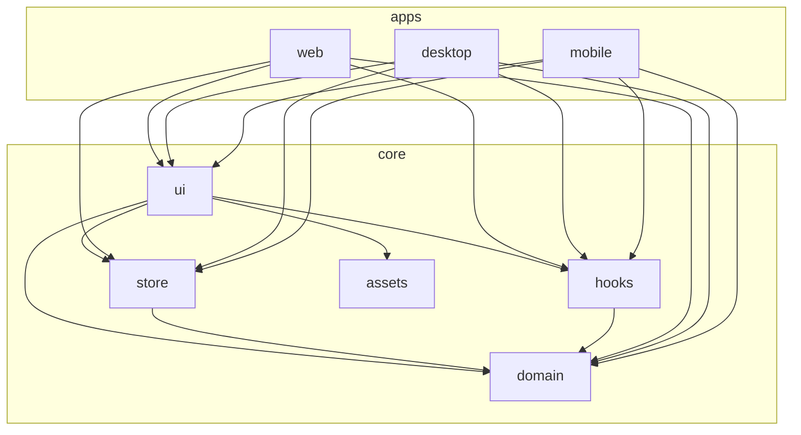
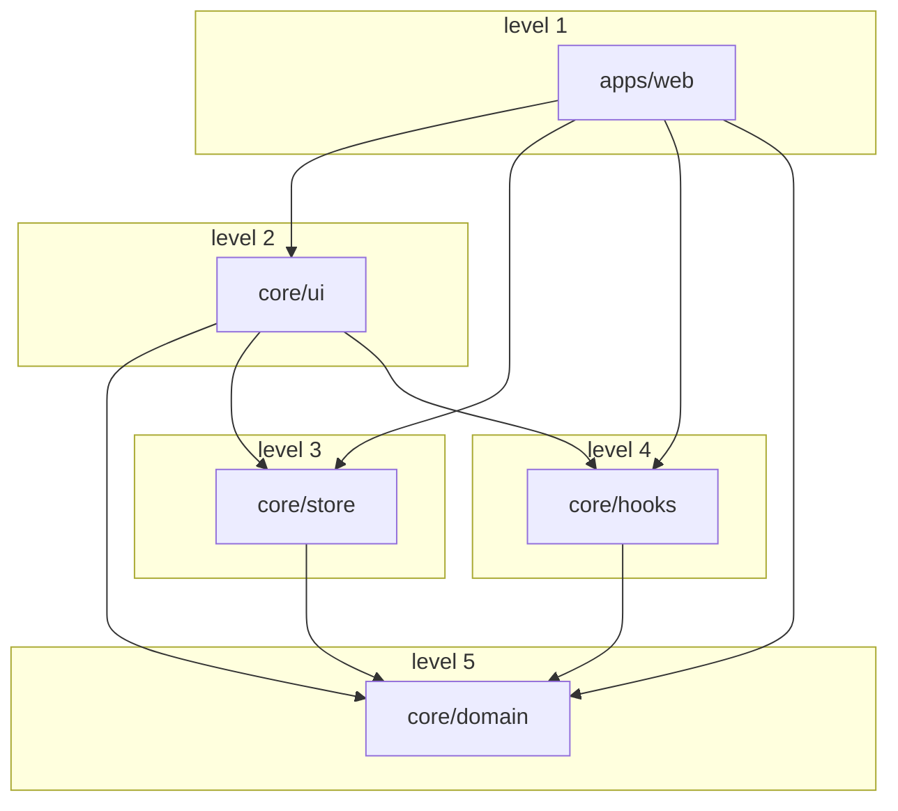
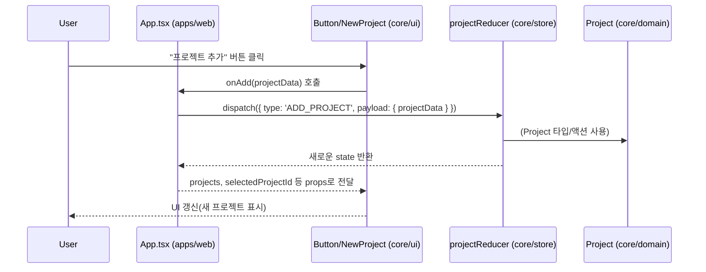
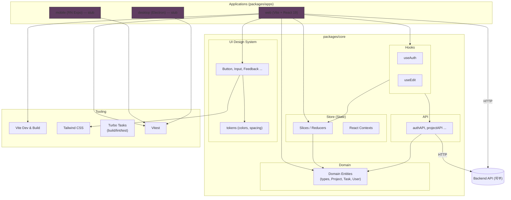
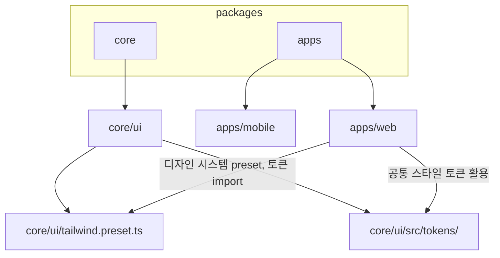
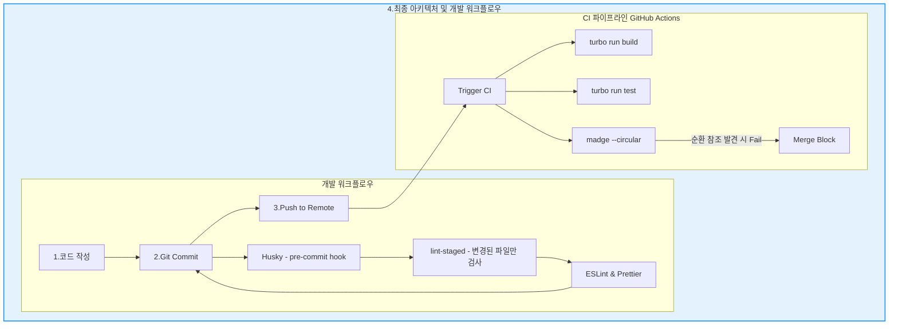
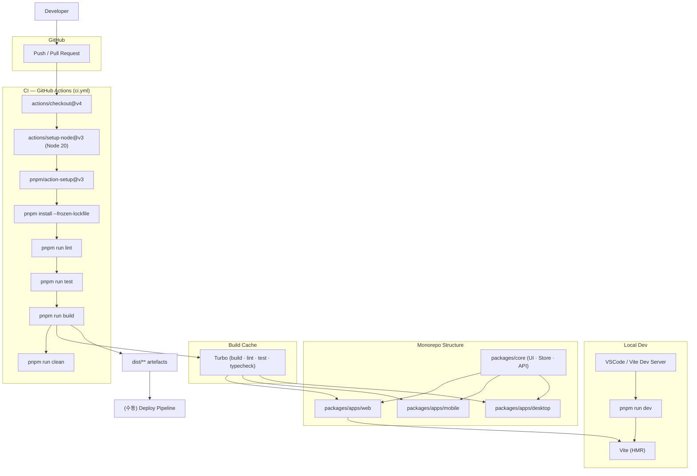
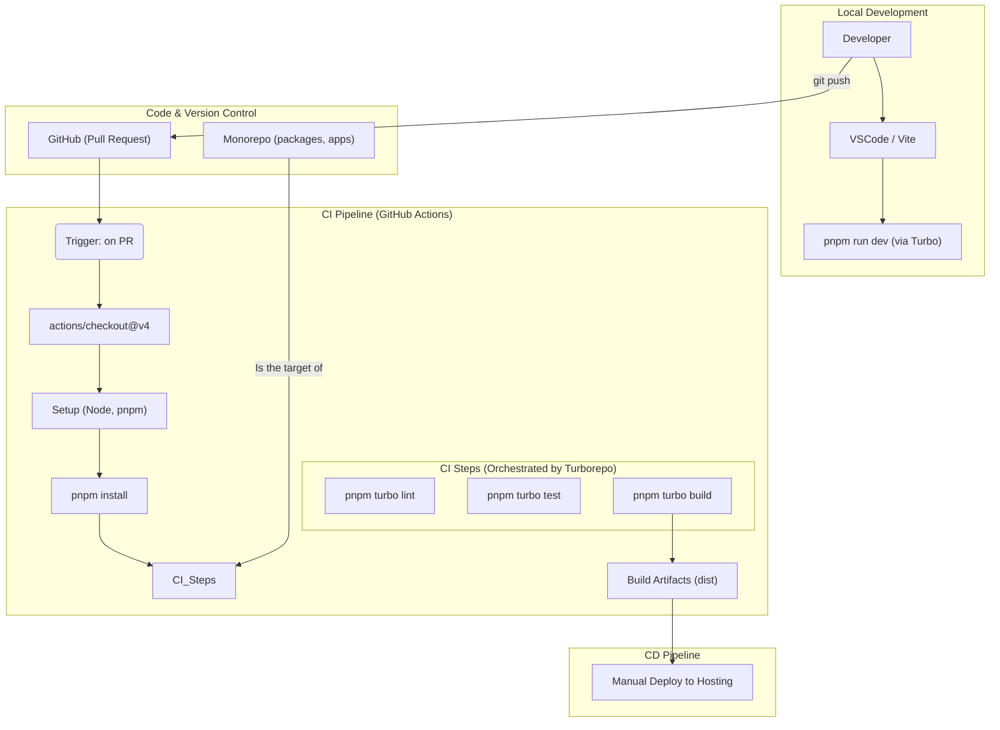

## 🚀 프로젝트 소개

백엔드 개발에만 머무르지 않고 프론트엔드 생태계에 대한 이해를 넓혀, '문제 해결 능력' 자체를 기르기 위해 시작하게 되었습니다.   
이를 위해 시스템의 모든 상호작용을 직접 설계하고 개발하며, 개발 프로세스 전반의 효율을 극대화하는 것을 목표로 하는 프로젝트 입니다.

## 📂 목차

## 🤔 왜 AI 기반의 Todo List 인가?

프로젝트의 지속적인 개발 동기를 부여하기 위해, 평소에 느끼던 개인적인 불편함에서 아이디어를 얻었습니다.

- **문제 인식**:
  
	- 혼자서 계획을 세울 때 항상 미루게 되는 문제를 겪어 왔습니다.
- **해결 방안**: 
	- AI가 할 일을 분석해 실패하는 이유와 문제점을 파악하고, 실행 가능한 작은 단위로 자동 분할해준다면 이 문제를 해결할 수 있을 것이라 생각했습니다.
	- 또한, '계획 미루기'는 개인적인 문제를 넘어 **많은 사람들이 공통으로 겪는 문제**라는 점에서, 이 프로젝트가 더 넓은 사용자층에게 실질적인 가치를 제공할 수 있게 만들 수 있다면 나름 의미가 있는 프로젝트가 될 수 있다고 생각했습니다.
- **도메인 선택**: 
	- 이 아이디어를 구현하기에 가장 적합한 도메인은 **'Todo List'** 였습니다. 
	- 복잡한 도메인 지식 습득에 드는 시간을 최소화하고, 그 시간을 **아키텍처 설계, 성능 최적화, 보안, CI/CD 구축** 등 핵심 역량 강화에 집중하는 것이 더 합리적이라고 판단했습니다.

 

## 📜 아키텍처 및 기술 스택

이 프로젝트는 제한된 리소스 환경 - 미니PC (홈서버) - 에서 운영하기 때문에, 각 기술 스택의 장점을 활용하여 효율성, 비용 최소화, 미니PC의 성능을 극대화 할 수 있는 방향으로 설계하고 있습니다.

해당 README는 아키텍처나 문제점을 해결할 때마다 변경사항을 지속적으로 업데이트할 예정입니다!   
보안적인 부분 때문에 코드는 비공개로 하는 점 양해부탁드립니다.   

좀 더 자세한 내용은 [블로그](https://ramyo564.github.io/git_blog/project_ai_todo/ai_todo_1_masterTable/) 에 기록해두었습니다.  

 

## **주요 목표**

- **아키텍처 설계 역량 강화**: 확장성과 유지보수성을 고려한 설계
- **프론트엔드 역량 강화**: TypeScript 기반의 UI/UX 구현
	- (React, ReactNative, Electron)
- **백엔드 심화:** 대용량 트래픽 및 I/O 병목 현상 해결 -> 성능 최적화

 

## 🖥️ **Frontend: `React` & `TypeScript` + `ReactNative` + `Electron`  (Monorepo)**

프론트엔드는 `TypeScript` 를 중심으로, **코드 재사용성과 개발 효율성**을 극대화하는 것을 목표로 했습니다.
- **기술 선택 이유**:
  
	- 이 서비스는 네이티브 수준의 고성능보다 **크로스 플랫폼(Cross-Platform) 지원**이 더 중요하다고 판단했습니다. 
	- `TypeScript` 생태계 안에서 웹(`React`), 모바일(`React Native`), 데스크톱(`Electron`)으로의 확장이 용이하다는 장점을 적극 활용하고자 했습니다.
- **아키텍처 (Monorepo)**: 
	- 효율적인 플랫폼 확장을 위해 **모노레포** 구조를 채택했습니다. 
	- 이를 통해 아래와 같은 핵심 자산을 여러 프로젝트에서 공유합니다.
      - **공통 비즈니스 로직**: `TypeScript`로 작성된 핵심 도메인 로직
      - **공유 UI 컴포넌트**: 여러 플랫폼에서 일관되게 사용될 UI 요소

이렇게 설계해서 코드 중복을 최소화했고, 하나의 로직 수정이 모든 플랫폼에 일관되게 반영되도록 하여 유지보수 비용을 크게 줄이는 쪽으로 만들었습니다.

### 1. 아키텍처 (apps와 core의 의존관계)

#### 예 : web app의 흐름도

- core 에서서 의존방향 규칙을 준수한다면 web에서 어떻게 사용하든 상관이 없다.

### 2. 데이터/액션 흐름

### 3. 각 앱의 공유 라이브러리 의존 관계 (예 : tailwindCSS)

### 4. 코드품질 자동화 시스템 아키텍처

### 진행상황
- [x] React 
	- [x] 모노레포 아키텍처 구조로 재설계
	- [x] 빌드환경 리팩토링 npm -> pnpm & turborepo 적용
	- [x] 개발환경 표준화 docker -> mise 적용
	- [x] CSS -> tailwindcss 적용
 		- [ ] 웹 -> 반응형 CSS 세밀 조정 	
	- [x] 코드품질 개선 -> madge, ESlint, husky 적용
	- [x] 최소기능 MVP 구현
	- [x] OAuth2 구글 로그인 연동 및 백엔드 연결
	- [x] 사용자 보안 강화 -> JWT + HttpOnly 쿠기 
	- [x] react-router-dom v6 -> v7 리팩토링
	- [x] Core 및 전역 상태관리 -> Redux 적용
- [ ] FastAPI 서버 구축
- [ ] Spring 성능 최적화 1차진행
	- [ ] DB 튜닝 
	- [ ] Redis 캐싱
- [ ] rabbitMQ -> 알림 및 타이머등 고도화 진행

 
 

## 🔧 **DevOps - Infrastructure**

**홈서버(미니PC)**:
  
개인용 미니PC를 홈서버로 운영하여 비용 절감과 인프라 구축 경험을 동시에 확보하는 것을 목표로 했습니다. 
이는 의도적으로 제약 조건을 설정하여 다음과 같은 학습 효과를 극대화하기 좋은 조건이라고 생각했습니다.
- 성능 최적화: 제한된 리소스로 인해 코드 레벨에서 병목 현상을 분석하고 해결하는 능력에 집중할 수 있도록 하는 것을 목표로 했습니다.
- 강화된 보안 의식: 모든 보안 책임을 직접 지는 환경을 통해 실수를 줄이고 경각심을 높아는 것을 목표로 했습니다.

### 프론트엔드 DevOps 설계

프론트는 **모노레포(Monorepo)** 아키텍처로 모바일, PC, 웹 등 다양한 플랫폼을 효율적으로 지원하고자 했습니다.   
이런 구조에서 코드품질 및 개발환경, 파이프라인을 구축하기 위해
ESLint, Husky, Mise등을 이용했습니다.

### 프론트엔드 모노레포 내부구조 + 도구 계층

### DevOps 파이프라인 (프론트)

### 진행상황
- [x] 우분투 서버 OS 설치 
- [x] SSH 키 설정
- [x] 공유기 보안 및 포트포워딩, DDNS 설정
- [ ] VPN 으로 SSH 연결
- [ ] 모니터링 환경 구축하기
- [ ] 부하테스트 환경 구축하기
- [ ] 도커로 환경분리
- [ ] CI/CD 구축
- [ ] NignX 

